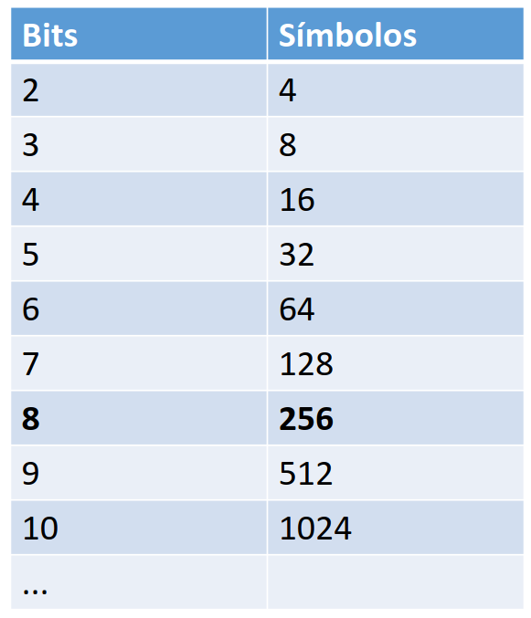
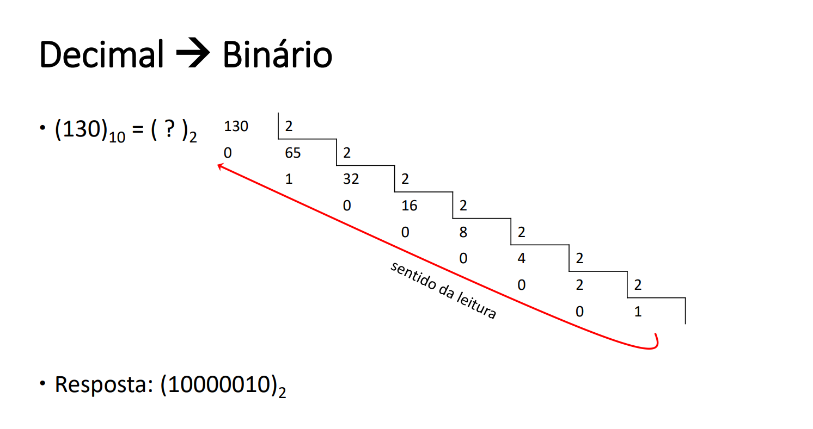

# Conversão pra binário e números fracionários.

Cada bit pode possuir um valor entre 0(zero) ou 1(um) identificando de forma digital a presença ou não de corrente elétrica passando pelo transistor.

Com cada bit podendo conter 2 informações diferentes, a concatenação de vários bits nos permitem representar várias informações de modo a ocupar o mínimo de espaço possível.

## Bytes:

Um byte é a junção de 8 bits, agora o babado é do porque que são 8 afinal. Na tabela ASCII, para representar as letras, os símbulos e os números precisamos de 128 caracteres. Intuitivamente eu pensei que como a tabela ASCII tem 128 caracteres, então 7 bits são mais do que o necessário. Então, não é; para “paridade” a gente reserva um dos bits pra isso e é isso mesmo. Um paradigma esse bit de paridade, não questiono só aprendo.

## Conversão:

### Decimal → binário:

Não tem mágica, vai dividindo por 2 ate não dar mais e vai olhando os restos de baixo pra cima.

### Binário → decimal:

Não tem mágica, é so distribuir os valores da lei de formação dos binários. Da direita pra esquerda, cada casa corresponde a um multiplo de 2, com excessão da primeira que começa com o 1.

## Conversão fracionária:

### Binário → decimal:

A parte inteira faz normal, e a parte fracionária eu uso a forma polinomial com índices negativos.

### Decimal → binário:

A parte inteira faz normal, e a parte fracionaria vai MULTIPLICANDO por 2 e pegando a parte inteira até zerar a parte fracionária.

### Extra de conversão divertidinho:

